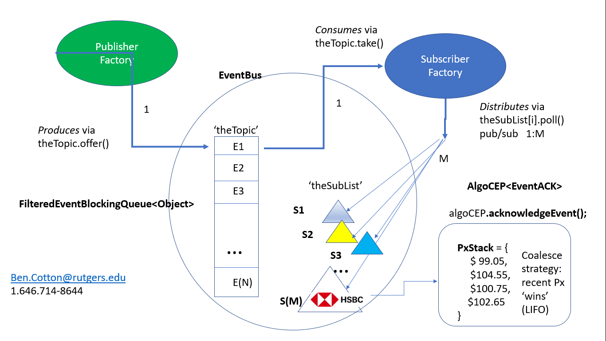

Fixed Income eTrading DEV

From ben.cotton@rutgers.edu (1.646.714-8644)

NOTE: Thank you Hashim, Boris, Arpita, Lalit et. al. at HSBC. -Ben

Home interview questions

For the below question, code as if it was going to be deployed to production. This means you should
follow your usual concerns when writing production code – think about appropriate tests,
maintainability, performance etc.

Think about when it is appropriate to use code you wrote in earlier questions.

You may use libraries from the internet where you think it’s appropriate to do so, but not if it’d
solve a core concern of the question.
Feel free to extend the interface where you think it’d benefit from doing so.

Question:
An event bus is similar to a messaging daemon – you publish messages to it, and subscribers receive
those messages.

Write a version of the EventBus designed for single-threaded use (thread calling publishEvent is the
same as the thread used for the callback on the subscriber).

Then write a version of the EventBus which supports multiple producers and multiple consumers (thread
calling publishEvent is different to thread making the callback)

Do not use any non JDK libraries for the multithreading.

Extra points if you can extend the multithreaded version (maybe by extending the interface) so it
supports event types where only the latest value matters (coalescing / conflation) – i.e.
multiple market data snapshots arriving while the algo is processing an update.

public interface EventBus {

         /* Feel free to replace Object with something more specific,
            but be prepared to justify it */

         void publishEvent(Object o);

         /* How would you denote the subscriber? */

         void addSubscriber(Class<?> clazz, ???);

         /* Would you allow clients to filter the events they receive?
            How would the interface look like?  */

         void addSubscriberForFilteredEvents(????);

}

----------------------- Ben.Cotton@rutgers.edu (ph=1.646.714-8644) submission below ---------------------------

NOTE:  submitted solution has ZERO logging design work implemented, and only skeletal @Test coverage
(Can develop both on Hashim's request)

NOTE:  submitted solution requires local environment have

1.  Java 1.8 core SDK and junit5 (jupiter project)
2.  Git
3.  Maven

To do:

#UserID=Cotton-Ben Password=Onefour9!

buddy@IdeaPad> git clone https://cotton-ben@github.com/Cotton-Ben/HSBC.git

buddy@IdeaPad> cd  HSBC

buddy@IdeaPad> mvn dependency:build-classpath -Dmdep.outputFile=cp.txt install -DskipTests

buddy@IdeaPad> #satisfies HSBC exercise to have Publisher & Subscriber

buddy@IdeaPad> #produce/consume EventBus actions on Same Thread

buddy@IdeaPad> java -cp \`cat cp.txt`:./target/classes/ com.hsbc.us.fiet.interview.cotton_ben.demo.HSBC_EXERCISE_1

buddy@IdeaPad> #NOTE: you must manually `kill -9` the JVM process (the SubscriberFactory on q.poll())

buddy@IdeaPad> #satisfies HSBC exercise (and extra credit) to have Publisher & Subscriber

buddy@IdeaPad> #produce/consume EventBus actions on different Threads.

buddy@IdeaPad> #Extra Credit = AlgoCEP impl (see PPTX screenshot: impl coalesece Px ticks )

buddy@IdeaPad> java -cp \`cat cp.txt`:./target/classes/ com.hsbc.us.fiet.interview.cotton_ben.demo.HSBC_EXERCISE_2_PLUS_EXTRA_CREDIT

buddy@IdeaPad> #NOTE: you must manually '`kill -9`' the JVM process (the SubscriberFactory on q.poll())

------------------------- deliverd EventBus.java interface ------------------

public interface EventBus {

    /* Feel free to replace Object with something more specific,
       but be prepared to justify it */

    void publishEvent(Object o);

    /* How would you denote the subscriber? */

    void addSubscriber(FilteredEventBlockingQueue o);

    /* Would you allow clients to filter the events they receive?
       How would the interface look like?  */

    void addSubscriberFiltered(Class<?> clazz, FilteredEventBlockingQueue<Object> o);

    /**
     *  added by Ben.Cotton@rutgers.edu
     * @param eventOn
     */

    void triggerSubscriberCallbacks(Object eventOn);

    BlockingQueue<?> getTheTopic();

    List<?> getTheSubsciberList();
}

